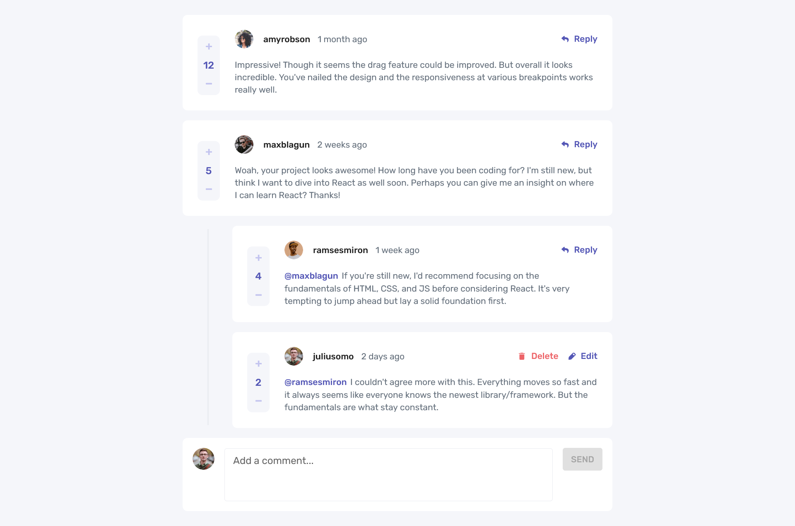

# Interactive comments section

## Table of contents

- [Overview](#overview)
  - [Functionality](#functionality)
  - [Screenshot](#screenshot)
  - [Links](#links)
- [My process](#my-process)
  - [Built with](#built-with)
  - [What I learned](#what-i-learned)
  - [Useful resources](#useful-resources)
- [Author](#author)

## Overview

### Functionality

Users are able to:

- View the optimal layout for the app depending on their device's screen size
- See hover states for all interactive elements on the page
- Create, Read, Update, and Delete comments and replies
- Upvote and downvote comments
- Use `localStorage` to save the current state in the browser that persists when the browser is refreshed.
- Use timestamps and dynamically track the time since the comment or reply was posted.

App's intended behaviour:

- First-level comments are ordered by their score, whereas nested replies are ordered by time added.
- Replying to a comment adds the new reply to the bottom of the nested replies within that comment.
- A confirmation modal pops up before a comment or reply is deleted.
- Adding a new comment or reply uses the `currentUser` object from within the `data.json` file.
- You can only edit or delete your own comments and replies.

### Screenshot

### Links

- [Github repo URL](https://github.com/Danny-Lenko/r-fm-comments-section)
- [Live site URL](https://r-fm-comments-section.vercel.app/)

## My process

### Built with

- [React](https://reactjs.org/) - JS library
- [TS](https://www.typescriptlang.org/) - JS superset programming language
- [Redux](https://redux.js.org/) - JS apps state manager
- [MUI](https://mui.com/) - React UI framework
- [Vite](https://vitejs.dev/) - Frontend build tool

### What I learned

1) set the cursor after the text on focus:
  [StackOverflow](https://stackoverflow.com/a/64980622/16906724)

2) render images dynamically in the dev mode in vite placed in the src folder:
  [StackOverflow](https://stackoverflow.com/a/74010629/16906724)

### Useful resources

- [Scrimba](https://scrimba.com/) - The educational platform for learning Frontend with the huge community
- [Foxminded](https://foxminded.ua/) - The mentoring based educational platform with wide variety of technologies

## Author

<!-- - My Portfolio - [Danny Lenko]() -->
- LinkedIn - [ValeriiDanylenko](https://www.linkedin.com/in/valerii-danylenko-74379212b/)
- Github - [Danny-Lenko](https://github.com/Danny-Lenko)
- Facebook - [Valerii Danylenko](https://www.facebook.com/valerii.danylenko)

